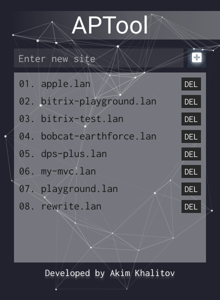

# APTool
Configure Bitrix compatable Apache sites on Ubuntu

##instruction to create alias
edit  ~/.bash_aliases

and insert these lines

alias APTool='sudo node ~/Projects/APTool/index.js'

alias APToolG='sudo npm run electron --prefix ~/Projects/APTool/ gIndex.js'

source ~/.bashrc

